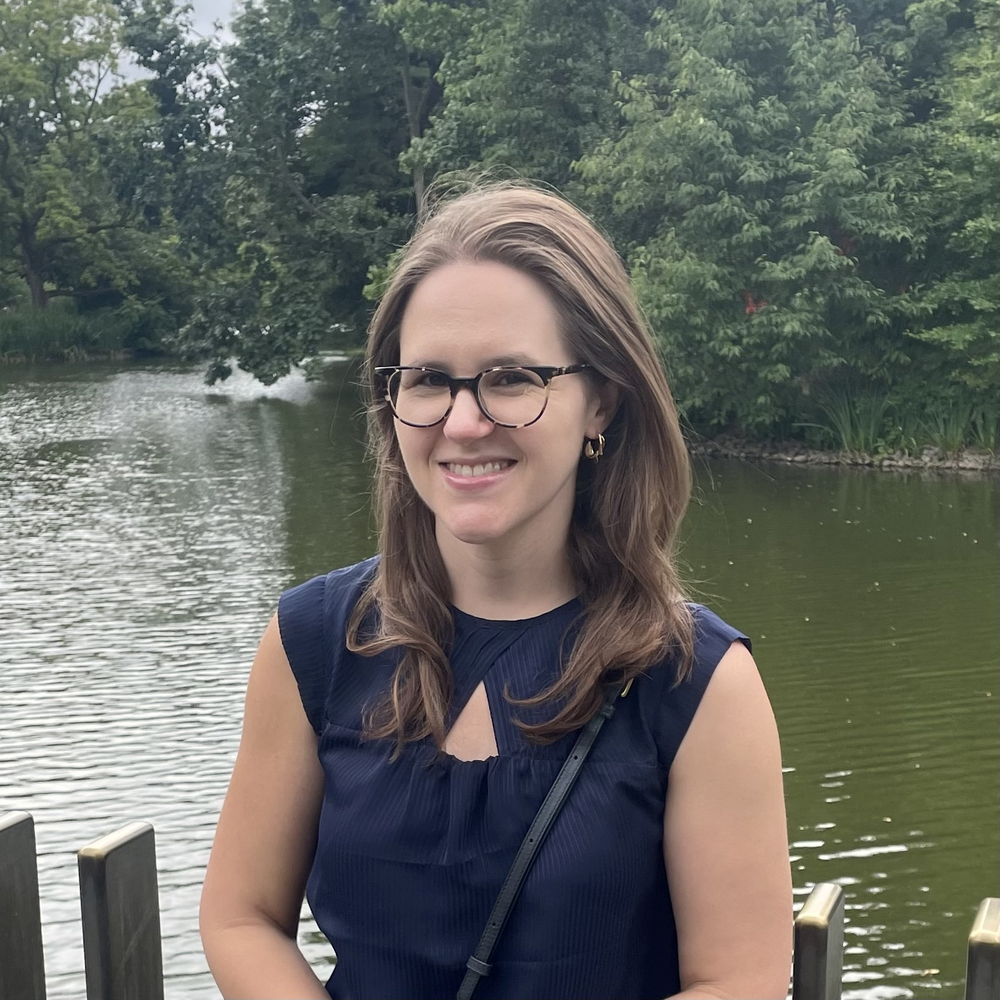

### Principal Investigator

	

		
	

	
	
	

	<b>Maggie Henderson</b>		
	 
		
	I am an Assistant Professor in the <a href="https://www.cmu.edu/dietrich/psychology/directory/core-training-faculty/henderson-maggie.html">Psychology Department</a> and <a href="https://www.cmu.edu/ni/">Neuroscience Institute</a> at CMU, also affiliated with the <a href="https://www.ml.cmu.edu/">Machine Learning Department</a>. Prior to this, I was a postdoc at CMU, working with Leila Wehbe and Michael Tarr. Before that, I earned my B.S. in Biological Sciences from Cornell University, then obtained my Ph.D. in Neurosciences from the University of California, San Diego, where I worked with John Serences. Outside the lab, I enjoy going for hikes around the Pittsburgh area, and playing with my cat Chamomile.
	  
	See my full CV <a href="files/CV_MH_2026.pdf">here</a>.

	

	

### Ph.D Students

	

		
	

	
	

	<b>Tamar Japaridze</b>
	 
	<i>Ph.D program in Cognitive Neuroscience</i>
	 
	I am from Tbilisi, Georgia (the country). I’m interested in how the human mind and brain represent concepts and build semantic maps. Specifically, I’d like to explore conceptual representations across visual, linguistic, and other modalities in the brain. I aim to use computational modeling and fMRI to study this topic. Fun fact: I can lick my elbow (rare ability)!

	

	

	

		
	

	
	

	<b>Yuhan Shi</b>
	 
	<i>Ph.D program in Cognitive Neuroscience 
	 
	(co-supervised with <a href="https://www.cmu.edu/dietrich/psychology/directory/core-training-faculty/susanne-ferber.html">Susanne Ferber</a>)</i>
	 
	My research focuses on visual cognition, especially in how perceptual representations interact with attention, memory, and higher-order cognitive processes. Outside of research, I love photography, and you can almost always find me carrying a camera around. I also like to play video games. I may not be an above-average gamer yet (or ever), but I am definitely working on it!

	

	

	

		
	

	
	

	<b>Junru Zhao</b>
	 
	<i>Ph.D program in Cognitive Neuroscience 
	</i>
	 
	My research interests lie at the intersection of human cognition and artificial intelligence. I study how the brain processes different levels of visual features, and I leverage these insights to design more effective and cognitively inspired AI systems. I was born in Beijing, a city where thousands of years of history meet modern life, and I love teaching people how to speak 地道的北京话 (the real Beijing way of speaking). Outside the lab, you can usually find me on the tennis or basketball court, behind a camera, or enjoying a Broadway musical.
	

	

### Ph.D Rotation Students

	

		
	

	
	

	<b>William Friebel</b>
	 
	<i>Ph.D Program in Neural Computation 
	</i>
	 
	I am broadly interested in how cognition interacts with visual perception. My current research focuses on how behavioral demands modulate visual representations. I employ different computational methods in my research, including ANN feature visualization, fMRI encoding models, and diffusion-based stimuli generation. Outside of the lab, I love baking (especially sweets), lifting weights, skiing, and listening to new house music!
	

	

### M.S. Students 

	

		
	

	
	

	<b>Achin Parashar</b>
	 
	<i>M.S. in Neural Technologies (MiNT)
	</i>
	 
	 I am interested in how we make decisions. What makes us behave a certain way, and can we nudge it with neurofeedback? For that, we need to know how our brains work!! :) I want to know how external signals shape our actions, and how can we leverage artificial neural networks to understand these processes? Outside the lab, you can find me benchmarking my own human-error on cricket, running, and (table) tennis.
	

	

### Undergraduate Students

	

		
	

	
	

	<b>Stephanie Lu</b>
	 
	<i> Cognitive Science (concentration in AI) and Human-Computer Interaction
	</i>
	 
	 Hello! I am an undergraduate student from New Jersey at Carnegie Mellon University studying Cognitive Science with a concentration in AI and an additional major of Human-Computer Interaction. My research interests are at the intersection of artificial intelligence and human social cognition, and I am specifically fascinated by how neural networks are able to perform on more complex tasks such as facial recognition. When I am not in the lab, I am most likely reading fiction, running around Pittsburgh, or eating with my friends!
	

	

	

		
	

	
	

	<b>Ahana Dey</b>
	 
	<i> Computational Neuroscience, minor in Artificial Intelligence
	</i>
	 
	 Hello! I am a undergraduate student studying Computational Neuroscience with an minor in Artificial Intelligence. My research interests lie in the intersection of neuroscience, computation, and analysis and I'm especially intrigued by how computational methodologies such as machine learning and modeling can be leveraged to study human visual behavior. Outside of the lab, I love to binge dramas, listen to unhealthy amounts of music, and travel around with friends and family!
	

	

### Lab Alumni

**Rae Gedangoni** (Vassar College/Dartmouth College)
 
<i>Undergraduate Program in Neural Computation (uPNC), 2026</i>
 

**Ziyu Li** 
 
<i>M.S. student in Computational Biology Program, 2024-2025.</i>
 

**Lucas Piper** (INESC-ID; IST, University of Lisbon)
 
<i>Visiting M.S. student through CMU-Portugal visiting student program, 2025</i>
 

**Dylan Diaz** (California State University, San Bernardino)
 
<i>Undergraduate Program in Neural Computation (uPNC), 2025</i>
 

**William Friebel** (Loyola University Chicago)
 
<i>Undergraduate Program in Neural Computation (uPNC), 2025</i>
 

**Gaurika Sawhney**
 
<i>Undergraduate research 2022-2025</i>
 
Major in Computer Science, Minor in Computational Finance

**Evren Konuk**
 
<i>Undergraduate research 2024-2025</i>
 
Major in Cognitive Science, concentration in Artificial
Intelligence

**Omisa Jinsi**
 
<i>Undergraduate research 2021-2022</i>
 
Major in Cognitive Science, concentration in Artificial
Intelligence

